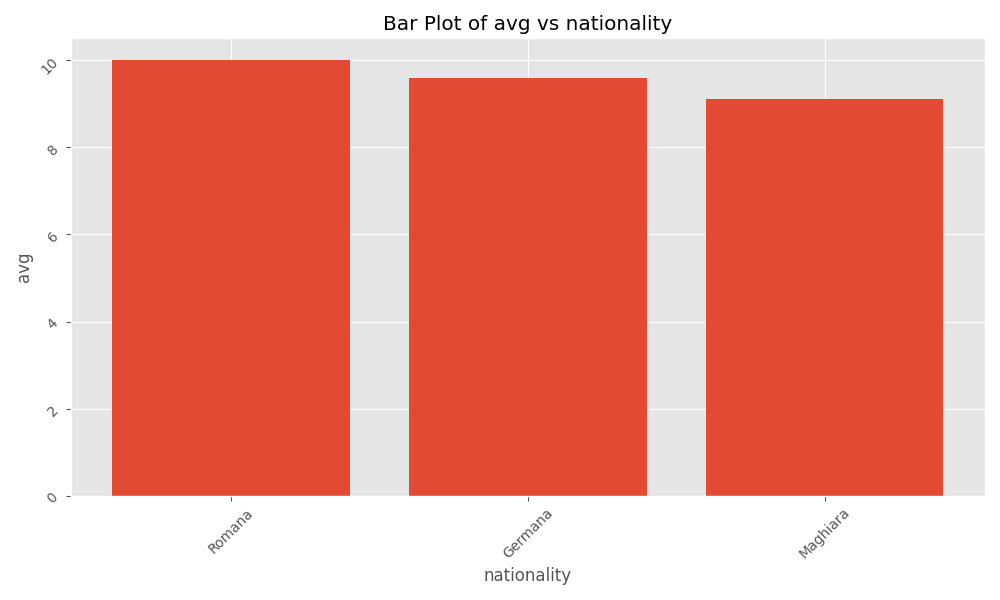

# PythonDatabaseVisualizer
This is a database visualizer based on pandas and matplotlib

## <strong>Step 1:</strong> Setting Up Your Project Environment
* <strong>Create a Project Directory:</strong> Open your terminal or command prompt 
and navigate to the location where you want to create your project. Run the 
following command to create a new directory:
<br><br>
```bash
mkdir PythonDatabaseVisualizer
cd PythonDatabaseVisualizer
```
<br><br>
* <strong>Initialize a Git Repository (Optional):</strong> If you want to keep 
track of changes using Git, you can initialize a new Git repository:
<br><br>
```bash
git init
```
<br><br>
* <strong>Create a Virtual Environment:</strong> It’s a good practice to use a virtual 
environment to manage your dependencies. Create and activate a virtual environment using:
<br><br>
```bash
python -m venv venv  # Create the virtual environment
```
<br><br>
* <strong>Activate the Virtual Environment:</strong>
<br>
* On Windows:
 ``` bash
venv\Scripts\activate
```
* On macOS/Linux:
```bash
source venv/bin/activate
```
* <strong>Install Required Libraries:</strong> You'll need a few libraries to handle SQLite and data visualization:
<br><br>
```bash
pip install pandas matplotlib
```
<br><br>

## <strong>Step 2: </strong>Creating the Project Structure
* <strong>Create Project Files and Folders: </strong>Organize your project with the following structure:
<br><br>
```csharp
PythonDatabaseVisualizer/
├── venv/
├── db_visualizer/
│   ├── __init__.py
│   └── visualizer.py
├── main.py
├── partial.db  # Your existing SQLite database file
└── requirements.txt
```
<br><br>
* <strong>Create `requirements.txt`: </strong>You can create a `requirements.txt` file to keep track of your dependencies:
<br><br>
```bash
pip freeze > requirements.txt
```
<br><br>

## <strong>Step 3: </strong>Connecting to the Existing Database
* <strong>Create the `visualizer.py` File: </strong>In the `db_visualizer/visualizer.py` file, 
you will define your `Visualizer` 
class to handle data visualization. Below is a template for your file:
<br><br>
```python
import pandas as pd
import sqlite3
import matplotlib.pyplot as plt

class Visualizer:
    def __init__(self, db_path):
        """Initialize the Visualizer class with the database path."""
        self.connection = sqlite3.connect(db_path)  # Connect to the SQLite database
        self.cursor = self.connection.cursor()

    def fetch_data(self, query):
        """Fetch data from the database using a SQL query."""
        return pd.read_sql_query(query, self.connection)

    def close_connection(self):
        """Close the database connection."""
        self.connection.close()

    def plot_data(self, df, x_column, y_column, plot_type='line'):
        """Visualize the data from a DataFrame."""
        # (Your plotting logic goes here, as discussed earlier)
```
<br><br>

## <strong>Step 4: </strong>Manipulating Tables in the Database
* <strong>Create the `main.py` File: </strong>In the `main.py`, you will use
the `Visualizer` class to connect to the database and fetch data for visualization:
<br><br>
```python
from db_visualizer.visualizer import Visualizer

def main():
    # Specify the path to your existing SQLite database
    db_path = 'partial.db'
    
    # Create an instance of the Visualizer
    viz = Visualizer(db_path)

    # Example query to fetch data
    query = "SELECT * FROM your_table_name"  # Replace with your actual table name
    data = viz.fetch_data(query)

    # Display the fetched data
    print(data)

    # Example of plotting
    viz.plot_data(data, 'x_column_name', 'y_column_name', plot_type='bar')  # Replace with actual column names

    # Close the database connection
    viz.close_connection()

if __name__ == "__main__":
    main()
```
<br><br>

## <strong>Step 5: </strong>Running the Project
* <strong>Run Your Script: </strong>After setting up the project, you can run your
`main.py` script:
<br><br>
```bash
python main.py
```
<br><br>

## <strong>Step 6: </strong>Interacting with the Visualizer
* After you run the project you will see a preview of the table,
with it's columns and a few entries.
* Once you have analyzed the table, it will ask you to choose a column to plot
to the X and Y axis.
* After choosing the columns it will ask you to choose a plotting format between
`linear/bar/scatter`. After choosing, you should see something like this:
<br><br>

